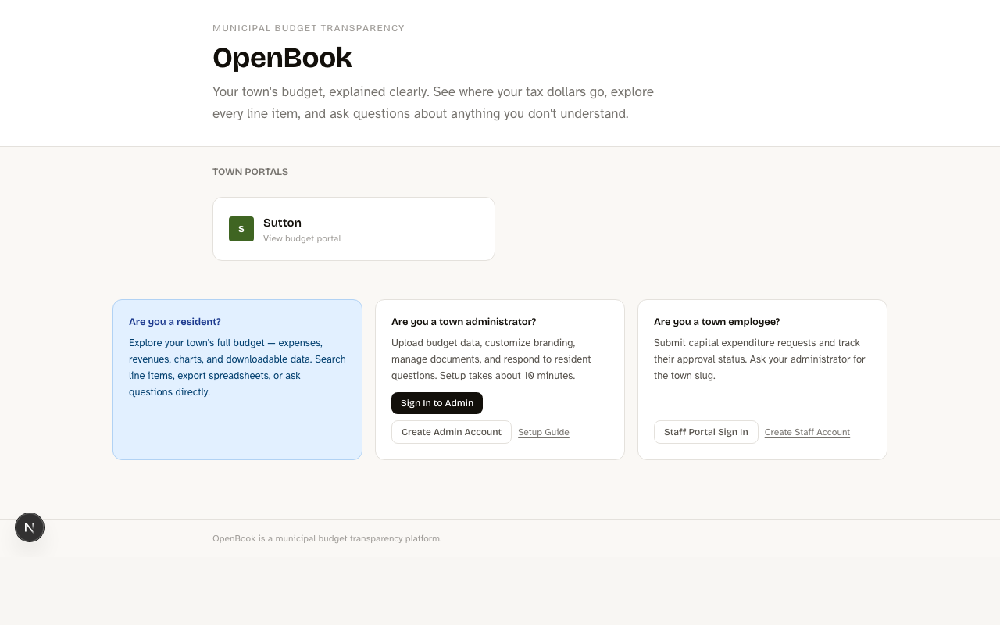
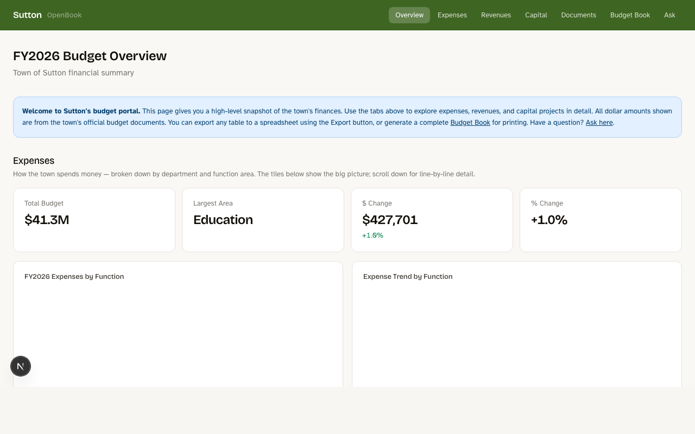
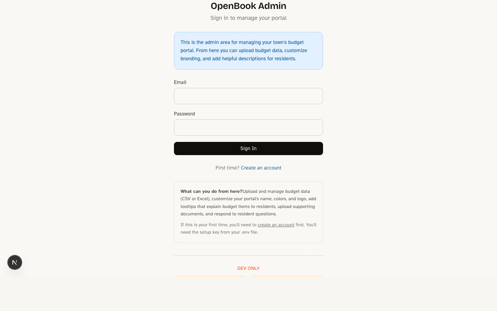

# OpenBook

A municipal budget transparency platform. OpenBook lets towns publish their budgets online so residents can explore expenses, revenues, and capital projects in plain language.



## Town Budget Portal

Each town gets a branded portal with tabbed navigation across budget categories, summary tiles, interactive charts, searchable line-item tables, exportable data, and a printable budget book.



## Admin Dashboard

Town administrators upload budget data (CSV or Excel), customize portal branding, add plain-language tooltips for budget items, manage supporting documents, and respond to resident questions.



## Features

**For residents**
- Budget overview with year-over-year comparisons
- Expense and revenue breakdowns by department and function
- Capital project listings with funding sources
- Searchable line-item tables with export to spreadsheet
- Printable budget book generation
- "Ask a Question" form routed to the town's finance office
- Supporting documents and external links

**For administrators**
- CSV/Excel upload with automatic column detection
- Portal branding (name, colors, logo, contact info)
- Tooltips that explain budget items in plain language
- Document and link management
- Resident question inbox with reply functionality
- Staff capital request review and approval

**For town staff**
- Capital expenditure request submission
- Request tracking and status updates

## Getting Started

### Prerequisites

- Node.js 18+
- npm

### Setup

```bash
npm install
```

Create a `.env` file:

```
DATABASE_URL="file:./dev.db"
ADMIN_SETUP_KEY="your-setup-key"
```

Initialize the database and seed sample data:

```bash
npx prisma migrate dev
npm run seed
```

Start the dev server:

```bash
npm run dev
```

Open [http://localhost:3000](http://localhost:3000).

## Tech Stack

- **Framework**: Next.js 16 (App Router, Turbopack)
- **Database**: SQLite via Prisma with better-sqlite3
- **Styling**: Tailwind CSS v4
- **Charts**: Chart.js + react-chartjs-2
- **Data import**: PapaParse (CSV), SheetJS (Excel)
